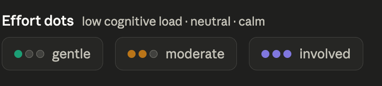

# Feature: Momentum & Difficulty

> **File:** `012_momentum_and_difficulty.md`
> **Status:** completed

## What & Why

**Problem:** Standard todo lists feel static. Users (especially those with ADHD) often lack a sense of "narrative progress" and can feel overwhelmed by a long list of tasks without knowing which ones fit their current mental capacity.

**Goal:** Provide a dynamic feedback loop through **Quest Momentum** (rewarding consistency and progress) and **Task Difficulty** (allowing users to match tasks to their current mental capacity).

**Not in scope (this release):**
- Complex XP, levels, or point-based gamification.
- Automatic difficulty detection from device sensors (e.g. step count, sleep).
- Shared quest momentum (initially personal only).

---

## How It Works

This feature is implemented in two distinct phases.

### Phase 1: Task Difficulty Level
Each task has a subjective difficulty attribute assigned by the user.

- **Simple Categories:**
    - **Easy** (5 min call, quick admin, "I'm tired")
    - **Medium** (Standard task, focus required)
    - **Hard** (Deep focus, high effort, "I'm fresh")
- **Default:** All new tasks are set to **Easy** by default to minimize creation friction.
- **UI:** A subtle indicator next to the task card in the list. 
- **Filtering:** Users can filter the task list by difficulty level. If they are tired, they can quickly see only the "Easy" tasks.

### Phase 2: User Momentum, Quest Momentum and Task Momentum Contribution
Momentum is a narrative feedback attribute for each user and each quest. It is NOT a score, but a representation of "how active" a quest is.
User momentum is contributed to by completing tasks.
Quest momentum is contributed to by completing tasks linked to the quest.

Each task will have a new attribute 'momentum_contribution' that represents how much momentum the task contributes to its quest.
Completing a task increases the user's and quest's momentum by the value of the task's 'momentum_contribution' attribute.

When a task is created or its difficulty level is changed, AI will be used to update the task's 'momentum_contribution' attribute.
The AI will use the task's difficulty level to determine the contribution value.
Easy difficulty tasks will contribute 10 points + 1-5 points determined by the AI based on the context.
Medium difficulty tasks will contribute 20 points + 5-10 points determined by the AI based on the context.
Hard difficulty tasks will contribute 30 points + 10-20 points determined by the AI based on the context.

There is an existing call to AI on task creation or update. We need to extend that one instead of adding a new one. See 011_AI-generated-nudges.md

- **Momentum Decay:** If a user's or quest's momentum doesn't increase for **24 hours**, it starts to slowly decrease (1% per day).
- **User Reminders:** Before a quest starts losing momentum (e.g. after 12 hours of inactivity), the user receives a "Nudge" (see Spec 011) suggesting a quick "Easy" task to keep it alive.
- **Visuals:** to be done later.

### 3. Future Expansion - Out of Scope for now
- **Difficulty Matching:** The system tracks the user's perceived capacity (e.g. via a quick "How are you feeling?" check-in or by observing completed tasks) and suggests tasks that match.
- **Difficulty Grooming Sessions:** A 60-second "refinement" session that guides the user through a stack of tasks that don't have a difficulty level allocated yet, ensuring the "doable now" filters stay useful.

---

## Done When

### Phase 1: Task Difficulty Level
- [x] `difficulty_level` field (enum: easy, medium, hard) added to `todos` table in Supabase.
- [x] TypeScript types updated to include `difficulty_level`.
- [x] UI added to `TodoDetailPanel` to select a difficulty level.
- [x] Task card shows a subtle indicator of the difficulty level.
- [x] Task list filtering by difficulty level is functional ("Doable Now" filter).

### Phase 2: Quest Momentum
- [x] `momentum` attribute (integer) added to `quests` table.
- [x] Completing a task increases the linked quest's momentum according to the difficulty scale.
- [x] Momentum decay logic implemented (cron job or background check every 24h).
- [x] Nudge/notification sent before momentum decay begins.

**Open questions**
- Should momentum have a "Max" cap (e.g. 100)?
- Does pausing a quest stop momentum decay? (Probably yes).
- How visible should the "Momentum Decay" be? (Subtle, to avoid "red overdue" stress).

**Implementation notes**
- Use a Supabase Edge Function or a simple periodic server task to handle momentum decay and reminders.
- Difficulty icons should be subtle enough to not distract from the task title.
- Momentum increase should be animated (see Spec 013).

---

## Rework: Momentum Achievement Summary (Proposed)

**Problem:** The current momentum system uses an abstract point value and a decay mechanism. This "hidden" calculation makes it difficult for users to see their actual productivity and can create negative pressure ("I'm losing points").

**New Goal:** Replace the points-based decay system with a **Daily Achievement Summary** that focuses on task counts and difficulty levels.

### How it Works (New Approach)

1. **Daily Totals by Difficulty Level:**
   - Instead of a single momentum score, the user's "Momentum" for a given day is a summary of completed tasks.
   - Example display: `Hard: 2 | Medium: 4 | Easy: 10`.
   - This provides a clearer sense of the "size" of the work done.

2. **Daily Task History:**
   - Users can view a list of specifically what they achieved on any given day.
   - This helps in reflecting on productivity and planning for the next day.

3. **Removal of Decay:**
   - The 24-hour decay logic (1% decrease) will be deprecated.
   - The focus shifts from "maintaining a score" to "building a streak of achievements."

### Implementation Strategy

- **Data Source:** Leverage the existing `completed_at` and `difficulty_level` columns in the `todos` table.
- **Filtering Logic:**
  - To calculate today's summary, query `todos` where `completed = true` and `completed_at` falls within the current calendar day.
  - Group the results by `difficulty_level`.
- **UI Changes:**
  - **Dashboard:** Update the momentum badge to show the difficulty-level breakdown (e.g., using small indicators or text).
  - **Task List:** Enhance the `TodoList` component to allow filtering/viewing completed tasks specifically for the active `dayDate`.
- **Database Deprecation:**
  - The `momentum`, `day_start_momentum`, and `last_momentum_increase` columns in `users` and `quests` tables will eventually be phased out or repurposed for high-level streaks.
  - The `process_daily_momentum` Supabase function and the `on_todo_completed_momentum` trigger will need to be refactored or removed.

### Visual Representation of Difficulty Levels

To make the UI clean and intuitive, the text-based labels ("Easy", "Medium", "Hard") will be represented by filled dots.

**Difficulty Indicators:**

*   **Easy:** ●
*   **Moderate:** ●●
*   **Involved:** ●●●
* display as in the picture below

**UI Implementation:**
*   **Task List:** The indicator will be displayed next to the task title (as currently done with subtle indicators).
*   **Detail Panel:** The selection buttons will use these dots instead of (or in addition to) the text labels.
*   **Filters:** The "Doable Now" filter will be updated to use the corresponding indicator.

### Database Cleanup & Deprecation

Once the new achievement-based momentum system is fully implemented and verified, the following columns and logic will be deprecated and removed to simplify the schema:

**Columns to Remove:**

*   **`public.users` table:**
    *   `momentum`: Abstract point value.
    *   `last_momentum_increase`: Timestamp for decay calculation.
    *   `day_start_momentum`: Reference point for daily progress.
*   **`public.todos` table:**
    *   `momentum_contribution`: Pre-calculated point value for tasks.
*   **`public.quests` table:**
    *   `momentum`: Abstract point value.
    *   `last_momentum_increase`: Timestamp for decay calculation.
    *   `day_start_momentum`: Reference point for daily progress.
    *   `last_momentum_nudge`: Tracking for decay-prevention nudges.

**Logic to Remove:**

*   `process_daily_momentum()` Supabase function and its scheduled execution.
*   `handle_todo_completion_momentum()` Supabase function.
*   `on_todo_completed_momentum` trigger on the `todos` table.
*   `maintainMomentum()` function in `src/lib/momentum.ts` (and its calls in the application).

